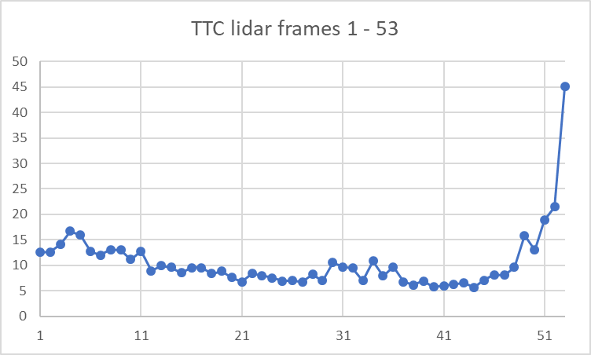
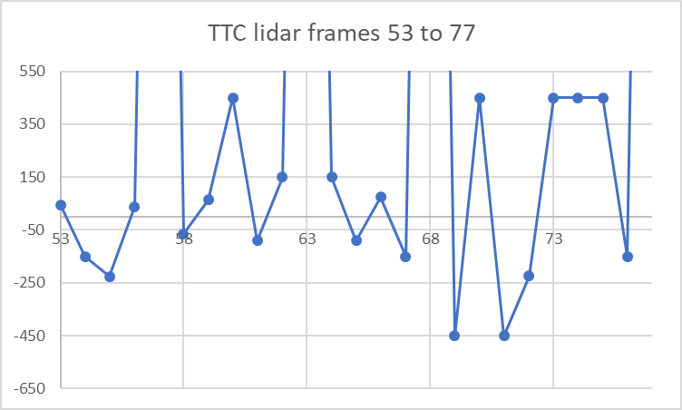
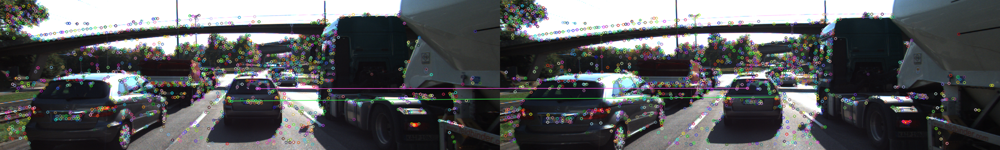
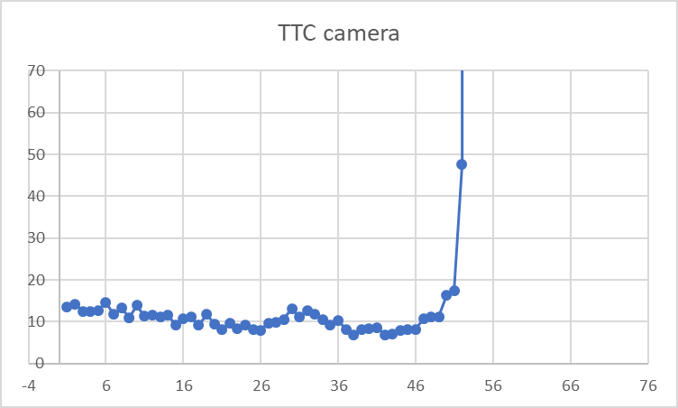
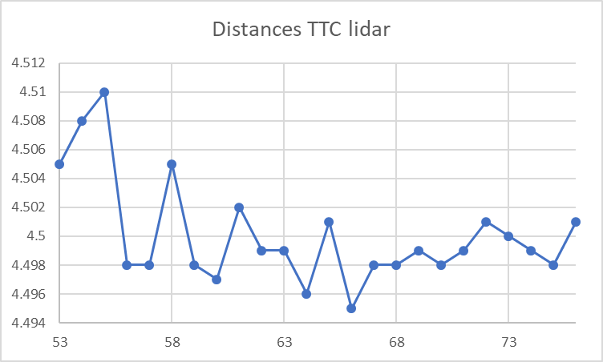
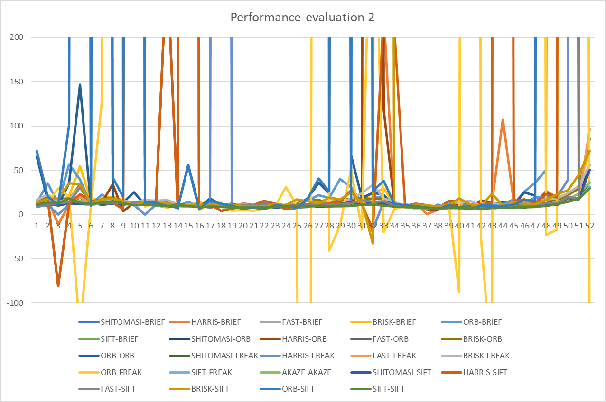
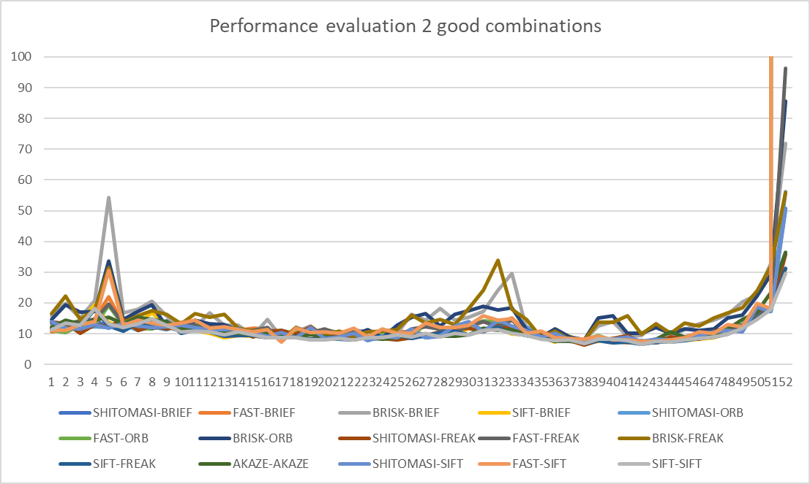

# SFND 3D Object Tracking

Welcome to the final project of the camera course. By completing all the lessons, you now have a solid understanding of keypoint detectors, descriptors, and methods to match them between successive images. Also, you know how to detect objects in an image using the YOLO deep-learning framework. And finally, you know how to associate regions in a camera image with Lidar points in 3D space. Let's take a look at our program schematic to see what we already have accomplished and what's still missing.

In this final project, you will implement the missing parts in the schematic. To do this, you will complete four major tasks: 
1. First, you will develop a way to match 3D objects over time by using keypoint correspondences. 
2. Second, you will compute the TTC based on Lidar measurements. 
3. You will then proceed to do the same using the camera, which requires to first associate keypoint matches to regions of interest and then to compute the TTC based on those matches. 
4. And lastly, you will conduct various tests with the framework. Your goal is to identify the most suitable detector/descriptor combination for TTC estimation and also to search for problems that can lead to faulty measurements by the camera or Lidar sensor. In the last course of this Nanodegree, you will learn about the Kalman filter, which is a great way to combine the two independent TTC measurements into an improved version which is much more reliable than a single sensor alone can be. But before we think about such things, let us focus on your final project in the camera course. 

## Dependencies for Running Locally
* cmake >= 2.8
  * All OSes: [click here for installation instructions](https://cmake.org/install/)
* make >= 4.1 (Linux, Mac), 3.81 (Windows)
  * Linux: make is installed by default on most Linux distros
  * Mac: [install Xcode command line tools to get make](https://developer.apple.com/xcode/features/)
  * Windows: [Click here for installation instructions](http://gnuwin32.sourceforge.net/packages/make.htm)
* Git LFS
  * Weight files are handled using [LFS](https://git-lfs.github.com/)
* OpenCV >= 4.1
  * This must be compiled from source using the `-D OPENCV_ENABLE_NONFREE=ON` cmake flag for testing the SIFT and SURF detectors.
  * The OpenCV 4.1.0 source code can be found [here](https://github.com/opencv/opencv/tree/4.1.0)
* gcc/g++ >= 5.4
  * Linux: gcc / g++ is installed by default on most Linux distros
  * Mac: same deal as make - [install Xcode command line tools](https://developer.apple.com/xcode/features/)
  * Windows: recommend using [MinGW](http://www.mingw.org/)

## Basic Build Instructions

1. Clone this repo.
2. Make a build directory in the top level project directory: `mkdir build && cd build`
3. Compile: `cmake .. && make`
4. Run it: `./3D_object_tracking`.

## FP.1: Match 3D Objects

First I've created a grid of matches. In the rows, I have in the previous frame bounding box ID, and in the columns, I have current frame bounding box IDs, and in the cells the number of matches.
When the grid is filled, I select the winner for each previous bounding box ID. The winner must be the column with higher value but only if it is also the winner in the row.
To test the algorithm I've added the `PRINT_TABLES_BOUNDING_BOXES` macro to print the tables. Here an example of the first pair of images:

||0|1|2|3|4|5|6|7|8|9|10|
|-|-|-|-|-|-|-|-|-|-|-|-|
|0|199|23|2|9|3|12|1|0|0|4|0|
|1|29|148|0|11|22|5|0|0|0|1|0|
|2|1|3|16|1|0|0|2|0|0|0|0|
|3|13|4|0|68|0|0|0|0|0|3|0|
|4|1|0|0|0|0|0|0|0|0|2|0|
|5|1|4|0|0|0|67|0|0|0|0|0|

Then I added the `CREATE_PNG_AVI_BOUNDING_BOXES` macro. When defined the program:

1. Adds to the `BoundingBox` structure a new field `color` to store a random color for each bounding box.
2. Set the color of the bounding box of the last frame in case of matching.
3. Write a .png file to create an animation to analyze the algorithm.

The result is this:

He can see the colors of each bounding box is maintained between frames so the algorithm is working correctly.

## FP.2: Compute Lidar-based TTC

To test the lidar clustering I created the define: `SHOW_LIDAR_CLUSTERING_WITHOUT_CROPPING`:

It looks like the clustering is working correctly and the `shrinkFactor` used in the call to `clusterLidarWithROI` is correct too.

To test the crop the lidar information focusing to the EGO lane I created the define `SHOW_LIDAR_CLUSTERING_CROPPING` :

We can see that almost all the frames are OK, but the last frames shows the car in the right lane. We want only the car in front of us, so since the first bounding box represents the car in the front lane in all the frames, I decided for this particular example to add `break;` (define `ANALYZE_ONLY_FIRST_BBOX`) in the loops that iterates the bounding boxes, so the result is this:

We can see in the last frames that there are points far from the car.
I don't like it, because that are clearly wrong points, so I decided to change the `maxX` value when calling to `cropLidarPoints` from __20__ to __10__ and the result is this:

Calculating the TTC with lidar was explained in the course, so we only have to calculate it using the median of the distances per frame. Defining `CREATE_PNG_AVI_TTC_LIDAR` we get this:

The first frames have expected values:

But starting from frame 50, the calculated values are wrong (negative values). The values that go out of the graph by the north are infinite (car stopped):

## FP.3 : Associate Keypoint Correspondences with Bounding Boxes

If all the matches were positive matches (no errors), the relationship between the distance of one pair of matches in the previous frame and the same pair of points in the current frame should be similar in all the possible pairs of matches. Because we know we have false positives, to found them, we can analyze the distance between each pair of matches in the previous frame and in the current frame and store the relationship between them in a table. Once the table is filled, in a specific cell we have the ration between the points row,column in the two frames. Defining `PRINT_TABLE_DIST_RATIO` we get the next table for the second frame:

||0|1|2|3|4|5|6|7|8|9|10|11|12|13|14|15|16|17|18|19|20|21|22|23|24|25|26|27|28|29|30|31|32|33|34|35|36|37|38|39|40|41|42|43|44|45|46|47|48|49|50|51|52|53|54|55|56|57|58|59|60|61|62|63|64|65|66|67|68|69|70|
|-|-|-|-|-|-|-|-|-|-|-|-|-|-|-|-|-|-|-|-|-|-|-|-|-|-|-|-|-|-|-|-|-|-|-|-|-|-|-|-|-|-|-|-|-|-|-|-|-|-|-|-|-|-|-|-|-|-|-|-|-|-|-|-|-|-|-|-|-|-|-|-|
|0|0.988635|1.00247|1.46337|1.06789|1.11803|0.998581|1.00225|0.992181|1.02572|1.03112|0.984832|0.98623|0.971034|0.926865|1.03203|1.00033|0.998126|1|0.956048|1.01936|1.15079|0.992484|1.01078|1.00245|1|0.999146|0.985409|0.986644|1|1|1|1.00139|1.00723|1.00327|1|0.998873|1.04272|1|1.00947|0.972907|0.97404|0.976204|1.03685|1|1.00701|1.00328|0.26486|1.00766|1|0.902423|1.00741|1|1|0.847141|1.01279|1.00092|0.996569|1.18146|1.0002|1.0621|1.00434|1.01286|1|0.969725|1.0386|1.00277|1|1.01524|1|1.02029|6.47393e+15|
|1||0.988635|1.01713|0.212959|1.01294|1|1.01855|1.01588|0.997883|1|1|1|1|0.985511|1|1|1.02068|1.01658|0.99205|1|1|1|0.980899|1.03038|1.0137|1.02796|1.02056|1.0549|1.04812|0.988241|0.994916|1.03387|1.01523|0.994107|1.00797|1.11249|1|1|1.01992|0.985599|1|0.997544|1.01407|1|0.965011|1|1.00726|1.29303|1|0.998618|1.07303|0.982491|1.00985|0.98432|1|0.984515|1|1|0.859949|1.04285|1.01014|1.01705|0.986329|1.00572|1.00554|0.983359|1.01866|1.0139|1|1.04043|1|
|2|||1.00247|1.01713|0.706059|1.01618|1.00808|1|1|1.02404|1.00885|1.0084|1.01237|1.0099|1|1.00808|1.0089|1|1|1.00303|1.00927|1.00768|1.00751|1|0.955249|1|1.00904|1|1.02212|1.02324|1.00439|1.00629|1.02833|1|1|1|1.01079|1.01579|1.00803|1.03306|1|1.00955|1.01179|1.01623|1.00825|0.998974|1.01003|1|16.556|1.00533|1.00692|1.20533|1|1.01693|1.0038|1.00789|1|1.0137|1.02162|0.781682|1|1.01348|1|1|0.970329|1.01107|1|1|1.02815|1.00871|1.0254|
|3||||1.46337|0.212959|0.706059|1.46479|1.48905|0.637657|0.721861|0.676395|1.45729|1.4238|5.17741|1.8942|1.43958|1.51303|1.59267|0.648574|0.648401|1.38643|1.787|1.2892|1.42886|1.69502|0.742949|0.752162|0.911945|0.627192|0.688805|0.59346|1.76767|1.71435|0.521432|0.727607|0.991071|0.842441|0.381507|1.16409|1.41804|0.680209|1.26951|1.83782|1.80416|2.31469|1.42796|1.41005|1.74772|0.8549|1.03303|1.10358|1.58648|1.07843|1.14975|0.73016|1.88476|1.491|1.4342|1.3197|0.878358|1.09141|0.409616|1.3809|0.690811|1.37243|0.763125|1.45607|1.61722|0.687184|0.72135|1.31573|
|4|||||1.06789|1.01294|1.01618|1.46479|1.02774|1.01684|1.01544|1.00783|1.03373|1.01947|1.0196|1.03264|1.02315|1.01337|1.06732|1.01592|1.01714|1.03602|1.02323|0.99747|1.00094|1.03736|1.02458|1.01478|1.03033|1.01665|1.01632|1.01509|1.05045|1.03806|1.01975|1.01438|1.02644|1.01264|1.02751|1.01389|0.961769|1.01604|1.03087|1.02899|1.04474|1.0251|1.01813|1.02834|1.0416|1.01208|0.0978248|1.00084|1.03571|0.889171|1.02977|1.01405|1.05804|1.01261|1.03602|1.01559|1.01172|1.26474|1.02067|1.05217|1.02082|1.03388|1.01297|1.03455|1.11612|1.01714|1.01446|
...

We can calculate the median of distances between each row in the last table getting this table (defining `PRINT_TABLE_MEAN_DIST_RATIO`): 

|Match|Median|
|-|-|
|0|1|
|1|1|
|2|1.00792|
|3|1.27936|
|4|1.01967|
|5|1.00732|
|6|1|
|7|1.00759|
...

Analyzing las table we get next  (define `SHOW_REFUSED_KEYPOINTS`):

Mean: __1.00721__
Standard deviation: __0.0482736__

One way to detect false positives is to avoid the matches with a mean > 2.5 times the standard deviation, so finally we detect as false positives the next matches: __3__, __47__.

The next screenshot shows these two points and as expected, both of them are bad matches.

## FP.4 : Compute Camera-based TTC

It's not optimized because 90% of the work was done in the point FP.3, but because I don't want to change the signature of `computeTTCCamera`, I've to repeat some work here. The method is to  calculate the median dist ratio and then calculate the TTC with that median dist ratio.

What I got was (defining `SHOW_TTC_CAMERA`):

## FP.5 : Performance Evaluation 1

As shown in the last screenshot of the point FP.2, the lidar-based TTC estimation from frame 53 is not working correctly. 53 is exactly the frame in where the camera-based TTC estimates infinite (both cars are stopped), but beginning from frame 53, lidar TTC sometimes gives you infinite, sometimes positive values and sometimes negative values (meaning that the car already collided). The problem can be because of several reasons:

1. The most important thing is that we're using the median of the measurements, and because of that, we're not using the same point in the car. Sometimes it will be in the part of the car nearest to us and sometimes not.
2. The reflection of the lidar in reflective surfaces (like the metallic surface of the front car) can bring values with an imprecision because of the dispersion of the beam in specular surfaces. When de car is far, that error is no significant, but when the car is near, that errors have are more significant.
3. The lidar is not precise at short distances.

We could analyze not only the TTC, but the distance used to calculate the TTC to see the distances that are being used in the case of lidar for the last frames (in which the front car is supposed to be stopped) to get an idea of how imprecise the lidar is working (define `SHOW_DISTANCE_LIDAR`):

The mean is __4.499__ and the standard deviation is __0.003634576__ meters (__3.6__ mm). That imprecision of 3.6mm is giving wrong values when the car is stopped and can give us even negative TTCs.

## FP.6 : Performance Evaluation 2

The next graphic shows all the combinations. The lines going to the top of the graphic means infinite. The graphic shows frames from 1 to 53 (frames where the car is moving closer, so infinite values means an error):

Deleting the combinations of detector/descriptor that gives infinite to the frames 1 to 53 we get this:

Why some combinations has wrong estimations? 

Because that combination of detector/descriptor gives a really small number of keypoints as we can see in the next example:

Let's see the keypoints matched with ORB-SIFT:

I think the most stable combination is SIFT/SIFT.

